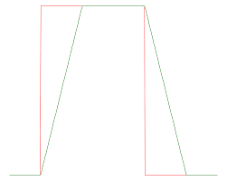

# OnlyUpSlewRateLimiter

The Slew Rate Limiter is basically just a low-pass filter that limits the rate of change of a signal. It is used to smooth out rapid changes in a signal, which can be useful in various applications such as audio processing, control systems, and more.

It is easy to use on motors and limit acceleration completely.



^ where green is output and red is input ( and ignore the second part as it is decreasing there)


## How to use

`OnlyUpSlewRateLimiter slewRateLimiter = new OnlyUpSlewRateLimiter(0.5);` where the first parameter is the rate of change in units per second. For example, if you want to limit the rate of change to 0.5 units per second, you would set the parameter to 0.5.

`slewRateLimiter.calculate(0.5);` where the first parameter is the input value. This method will return the output value, which is the input value limited by the slew rate.

```java
@TeleOp
public class TestOpMode extends LinearOpMode {

    @Override
    public void runOpMode() throws InterruptedException {
        SlewRateLimiter slewRateLimiter = new SlewRateLimiter(0.5);

        telemetry.addData("Status", "Initialized");
        telemetry.update();

        waitForStart();

        while (opModeIsActive()) {
            motor.setPower(slewRateLimiter.calculate(gamepad1.left_stick_y)); // this will do approximately the same thing as SlewRateLimiter, but only on the increase. When decreased it will go with the input only
        }
    }
}
```