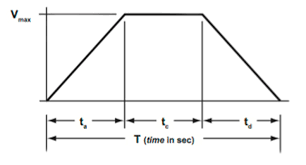

# TrapezoidalMotionProfile

The trapezoidal motion profile is a type of motion profile that is commonly used in robotics and control systems. It is characterized by a trapezoidal shape, which consists of three phases: acceleration, constant velocity, and deceleration. This type of motion profile is often used to control the movement of robots, motors, and other mechanical systems.



## How to use

The trapezoidal motion profile is typically defined by four parameters: the maximum velocity, the maximum acceleration, the distance to travel, and the time to reach the target position. The motion profile can be calculated using these parameters, and the resulting trajectory can be used to control the movement of the system.

`TrapezoidalMotionProfile profile = new TrapezoidalMotionProfile(maxVelocity, maxAcceleration);` where the first parameter is the maximum velocity,and the second parameter is the maximum acceleration.

`trapezoidalMotionProfile.generateProfile(10);` where the first parameter is the distance to travel. This method will make the profile to follow.

```java
@TeleOp
public class TestOpMode extends LinearOpMode {

    @Override
    public void runOpMode() throws InterruptedException {
        TrapezoidalMotionProfile profile = new TrapezoidalMotionProfile(1, 0.5);
        profile.generateProfile(10);

        telemetry.addData("Status", "Initialized");
        telemetry.update();

        waitForStart();

        while (opModeIsActive()) { // this is an autonomous example
            profile.start();
            motor.setPower(profile.getVelocity()); // sets power to the velocity
            profile.regenerateProfile(distance); // regenerates the profile
        }
    }
}
```